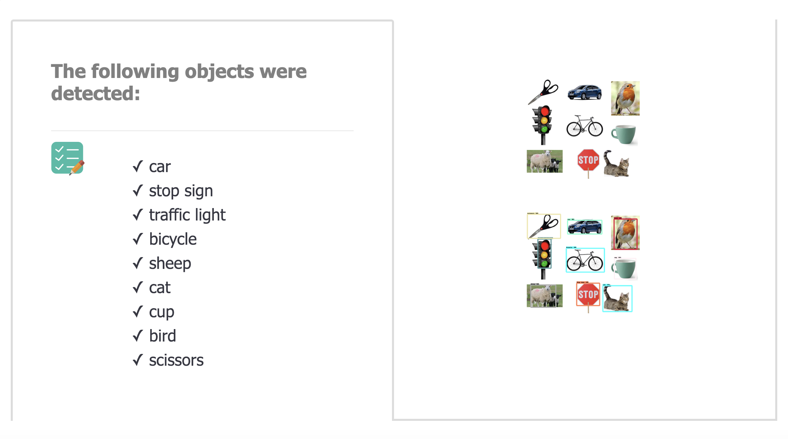

## Kay: Adding Soundscapes to Imagery



### TO RUN: 

```python
FLASK_APP=main.py FLASK_DEBUG=1 flask run
```

What is currently installed in virtual environment can be found in `currentenv.txt`.  
**Note: not all are required dependencies**
