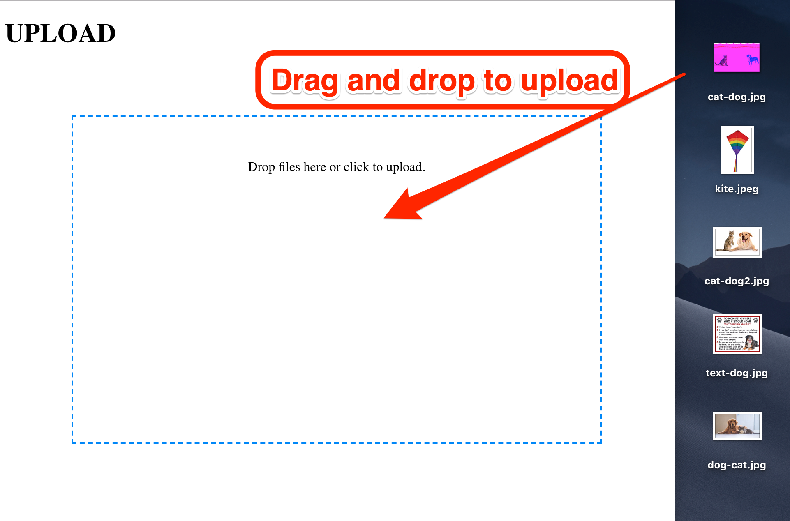
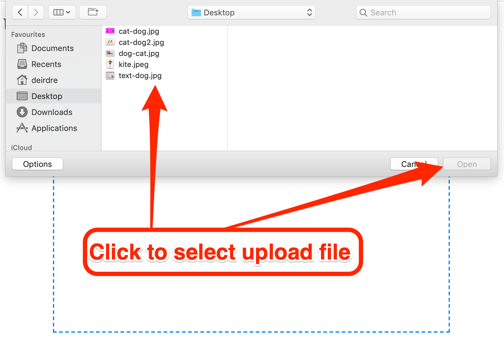
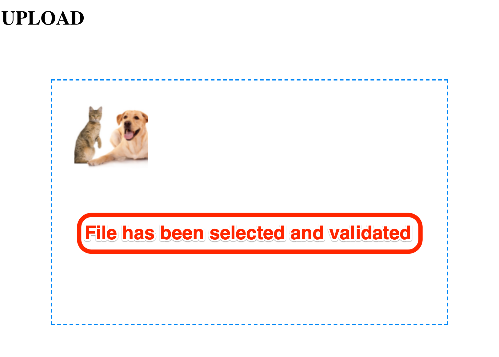
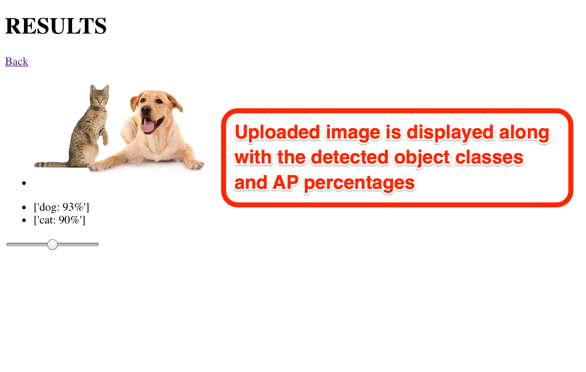

---
title:              Interim
author:             Deirdre Hegarty
email:              deirdre.hegarty@mu.ie
date:               December 2018

toc:                yes
fontsize:           11pt
geometry:           margin=25mm
linespacing:        1.15
papersize:          A4
link-citations:     true
...
\pagebreak

## Goals of the Project

The intention of this project is to explore the relationship between audio and image. Synaesthesia describes the impression of one sense on another, whereas cognition can reflect a learned association of the same.  

Using a machine learning framework and audio references, photographs will be broken down into their object content labels. These labels will describe what is present in each photograph. Once images have been analysed, an audio sample that best describes each label will be retrieved from an audio reference list. The result is to create an auditory explanation of the scene through sounds instead of words (spoken or other).

## Overview an Progress to Date

{width=320px}\ {width=320px}

The Flask application uses `Flask-Dropzone` and `Flask-Uploads`. The selected files are validated against a list of predefined accepted file types. The dropzone will reject a file if it is not of an accepted format.

{width=400px height=250px}
\

When an image is uploaded to the application, Flask passes the image to the /uploads. Tensorflow can then retrieve the images from /uploads and perform object detection. The dataset used by the CNN model is COCO [@coco]

An output image is generated and written to /detected_images; this image will have bounding boxes drawn around the detected objects, along with labels containing the detected class and percentage of AP (average precision). The list of classes present in each image is passed from the Tensorflow module to Flask, to be created in the DOM and displayed in the browser.

{width=400px height=250px}
\

Once in the `results` route, audio files relating to the detected classes are retrieved. Each audio file is rendered inside the source of a html audio tag and is then triggered using a javascript API.

A more detailed explanation of current functionality can be found in appendix A.

## Problems Encountered

The first issue that I encountered was caused by a missunderstanding of the meaning of object classification versus object detection. I had gone about researching and implementing small examples of using pytorch for object classification. I soon reasised that in order to achieve the results that I wanted, I would need to implement a model that would return bounding boxes, along with the detected class list.

I had planned on using Keras, a high-level neural networks API [@keras] which can run on top of Tensorflow. This would have proven problematic later in the project when retrieving audio that corresponds to detected classes. Because of my decision to use Tensorflow directly, I was able to add to the code for the CNN model and create extra functionality that was not already present. Keras is a more abstract solution, meaning that I would have needed to come up with some sort of work around to retrieve object coordinate data.

Originally I had thought that Python would provide a perfect solution for triggering multiple audio file via different channels. I implemented some example code that triggered audio using Pygame [@pygame]. I developed a solution for dynamically retrieving audio relating to specific object classes. However, there came an issue when I began to integrate the pygame module into the Flask application. Pygame and Flask compete to work on the main thread; throwing errors. After spending some time trying to resolve the issue, I decided that researching another approach would be a more valuable use of time. Instead of trying to process the audio functionality in the back-end, I decided to use a client-side solution, Web Audio API [@web_audio]. Written in JavaScript, Web Audio API allows for the same functionality as Pygame, without restricting me to a specific number of channels.

## Planned Steps to completion

* Work on GUI.
* Explore the possibilities of using moving image.
* Decide on appropriate timing for triggering multiple audio files.

\pagebreak

## References

