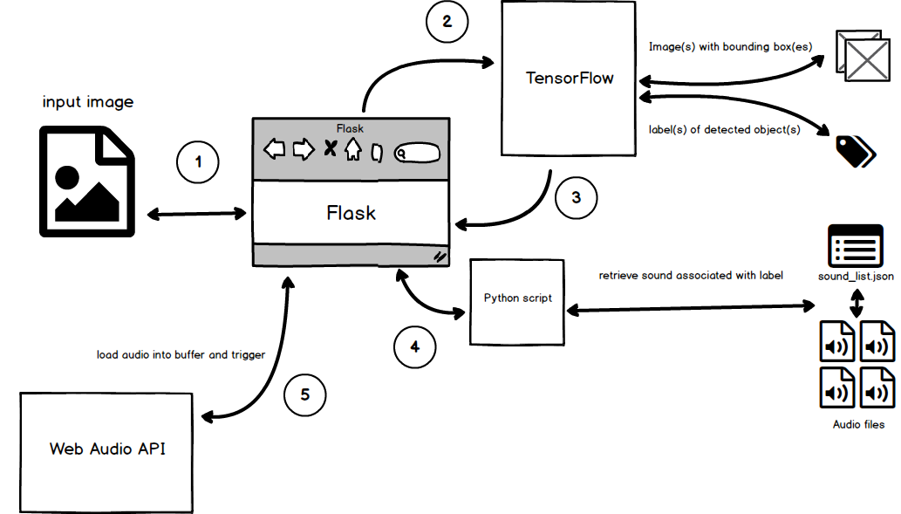
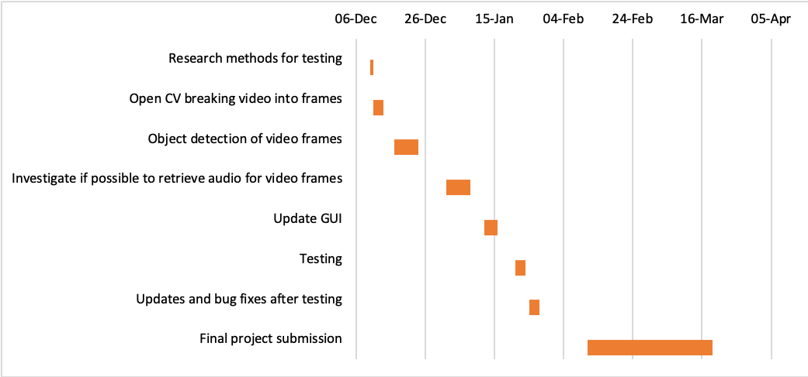

---
title:              Interim Report
author:             Deirdre Hegarty
email:              deirdre.hegarty@mu.ie
date:               December 2018

toc:                yes
fontsize:           11pt
geometry:           margin=25mm
linespacing:        1.15
papersize:          A4
link-citations:     true
...
\pagebreak

## Goals of the Project

The intention of this project is to explore the relationship between audio and image. Using a machine learning framework and audio references, photographs will be broken down into their object content labels. These labels will describe what is present in each photograph. Once images have been analysed, an audio sample that best describes each label will be retrieved from an audio reference list. The result is to create an auditory explanation of the scene through sounds instead of words (spoken or other).



Synaesthesia describes the impression of one sense on another, whereas cognition can reflect a learned association of the same.

## Overview and Progress to Date

The main languages used to develop this web application are Javascript and Python. The main application is delevoped using Python and Flask. Flask is a lightweight framework, written in Python, that allows users to develop web applications [@flask].   

The Flask application uses `Flask-Dropzone` [@flask_dz] and `Flask-Uploads` [@flask_up] for file uploading fucntionality. Selected files are validated against a list of predefined accepted file types. The dropzone will then reject a file if it is not of an accepted format. Flask also allows for client-sise sessions, which were useful differentiating and managing batches of image detected files. Figures 2 and 3 demonstrate the two different upload functionalities present in the application (drag and drop, or click and select).  

{width=320px} 

{width=320px}

Figure 4 shows the validation step for file types.  

{width=400px height=250px}

When an image is uploaded to the application, Flask passes the image to the /uploads. Tensorflow can then retrieve the images from /uploads and perform object detection. TensorFlow is an open-source software library for numerical computation, and is well known for its use in the fields of machine learning and deep learning [@tensorflow]. The dataset used by the CNN model is COCO [@coco].

{width=320px}

An output image is generated and written to /detected_images; this image (seen in Figure 5) will have bounding boxes drawn around the detected objects, along with labels containing the detected class and percentage of AP (average precision). The list of classes present in each image is passed from the Tensorflow module to Flask, to be rendered as a list in the browser along with the originally uploaded image. This can be seen in Figure 6.

{width=400px height=250px}


Once in the `results` route, audio files relating to the detected classes are retrieved. Each audio file is rendered inside the source of a html audio tag and is then triggered using a javascript API, Web Audio API [@web_audio]. Web Audio API offers PannerNodes [@web_audio_pan], which allow for each audio file to be panned according to their position in the detected input image. BufferLoader [@web_audio_buf] used alongside the PannerNodes simulate the placement of audio on a virtual 3-dimensional audio plane. A more detailed explanation of this functionality can be found in Appendix A under the heading 'Sound Retrieval'.


## Problems Encountered

The first issue encountered was caused by a missunderstanding of the term object classification. After researching and implementing small examples which used pytorch for object classification, it was made apparent that object detection, as opposed to object classification, would be needed for this project. Image classification with localization outputs a class label and draws a bounding box around the detected object. Whereas, object detection allows for the same, but for multiple objects as opposed to one [@classvsdetect]. The return of multiple bounding boxes relating to the detected class objects is paramount to successfully placing sounds in a single soundscape.  

Originally Keras, a high-level neural networks API [@keras] which can run on top of Tensorflow, was considered to be good tool for this project. Using Keras would have proven problematic later in the project when retrieving audio that corresponds to detected classes. Keras provides clients the use of simple APIs, in turn limiting the control that the user has during implemetation of certain functionalities. Because of the decision to use Tensorflow directly, it was possible to add to and alter the code for the CNN model, creating extra functionality that was not already present. 

Before research had taken place, it was assumed that Python would provide a perfect solution for triggering multiple audio file via different channels. A solution for dynamically retrieving audio relating to specific object classes was develped using Pygame [@pygame]. However, there came an issue when integrating the pygame module into the Flask application. Pygame and Flask compete to work on the main thread; throwing errors. After spending some time trying to resolve the issue, it was decided that researching another approach would be a more valuable use of time. Instead of trying to process the audio functionality in the back-end, a client-side solution using Web Audio API [@web_audio] was implemented. Written in JavaScript, Web Audio API allows for the same functionality as Pygame, without restricting clients to a specific number of channels.


## Planned Steps to Completion

Currently not much time has gone into the design and layout of the application. The end project will hopefully be more refined in appearance, and will be easy to navigate. The Bootstrap framework [@bootstrap] will provide a responsive and adaptive layout for use on a multiple of device types. The realised application will provide information about the project, as well as the actual project itself.  

I anticipate that while exporing the possibilities surrounding moving image, there will be more complex questions regarding audio timing and coordination. The project will retrieve class labels for a multiple of related images, and track the movement of each detected object through a series of frames.  

Tensorflow makes classes for unit testing accessible to users [@tftesting]. For the purposes of testing this application, writing unit tests and comapring output labels against expected outputs would prove to be a useful exercise.   

Currently this project does not make use of an API for retrieving audio, or large audio database. Each audio file has been downloaded locally, and has been manually added to each object class in sound_retrieval/sound_list.json. Because of afore menioned reason, formal tests will not be written to check the audio retrieval element of the project.   

Project documentation has, and will take place in the form of a Github repository. This repository marks all progress made throughout the year, and is a rough mapping of process and anaylsis in realtime. There also exists a document that explains the breakdown of the project with regards to code present (please see Appendix A); this document will continue to be updated as the project progresses. Once complete, a formal document outlining research, analysis and thesis will be created.


\pagebreak

 

[@ex]

\pagebreak

## References

<div id="refs"></div>

\pagebreak

# Appendix A

## Flask-Dropzone and Flask-Uploads

\footnotesize

```
# basic Flask-Dropzone & Flask-Uploads file structure

app
├── detected_images
│   ├── dog.jpg
│   └── dog_car.jpeg
│
├── main.py
│
├── templates
│   ├── results.html
│   ├── skeleton.html
│   └── upload.html
│
└── uploads
    ├── dog.jpg
    └── dog_car.jpeg

```

\normalsize

Flask-Dropzone allows for files to be dragged and dropped into a Flask application with Drozone.js [@flask_dz]. A dropzone object is created and configured to accept images as input.  

Flask-Uploads is included to handle uploading of files to specific destinations. [@flask_up] 

### upload functionality

*uploads.html*  
`dropzone.create()` handles the uploads from a dropzone. It's argument needs to be set to the route that contains the dropzone.
[@flask_dz_create] 

\footnotesize

```python
# ...

	<h1>UPLOAD</h1>
	{{ dropzone.create(action_view='upload') }}
 
```

\normalsize

*skeleton.html*  
The dropzone object is loaded and style is applied. [@flask_dz_resource]

\footnotesize

```python
# ...
<!-- dropzone -->
{{ dropzone.load() }}
{{ dropzone.style('border: 2px dashed #0087F7; margin: 10%; min-height: 400px;') }}
# ...
```

\normalsize

*main.py*   
The configurations for the dropzone object and upload behaviour are set using Flask-Uploads and Flask-Dropzones predefined property settings. 

\footnotesize

```python
# ...
dropzone = Dropzone(app)
# Dropzone settings
app.config['DROPZONE_UPLOAD_MULTIPLE'] = True
app.config['DROPZONE_ALLOWED_FILE_CUSTOM'] = True
app.config['DROPZONE_ALLOWED_FILE_TYPE'] = 'image/*'
app.config['DROPZONE_INVALID_FILE_TYPE']
app.config['DROPZONE_REDIRECT_VIEW'] = 'results' 	# redirect to results.html
app.config['DROPZONE_MAX_FILE_SIZE'] = 10
app.config['SECRET_KEY'] = 'secretkey' 	 # will throw an error if not included

# Uploads settings
app.config['UPLOADED_PHOTOS_DEST'] = os.getcwd() + '/uploads'
photos = UploadSet('photos', IMAGES) # name of upload set, allowed extensions
configure_uploads(app, photos) 	 # load the configuration for the upload sets
```

\normalsize

The Flask `upload` route specifies the viewport and behaviours of the application for uploading an image. A session is started for each visit to the `upload` route. Any files from a previous sessions are cleared and the folder containing previously uploaded images is emptied.  

When a new image is uploaded, and satisfies the above configurations, the file is saved to a predetermined destination and the url is saved to the session. The application is then redirected to the `result` route.

\footnotesize

```python
@app.route("/", methods=['GET', 'POST'])
def upload():
	# empty contents of uploads folder
	object_detection_main.delete_uploads()

	# set session for image results
	if "file_urls" not in session:
		session['file_urls'] = []
	
	# uploaded image urls
	file_urls = session['file_urls']

	# clear any unsubmitted images from previous attempts
	session.pop('file_urls', None)

	# image upload from Dropzone
	if request.method == 'POST':
		file_obj = request.files
			
		for f in file_obj:

			file = request.files.get(f)
			app.logger.debug(file.filename)
			
			# save the file & append image urls
			filename = photos.save(file, name=file.filename)
			file_urls.append(photos.url(filename))

		session['file_urls'] = file_urls	
		
	return render_template('upload.html', title='upload')

# ...

```

\normalsize

### display functionality

The session is checked to see if there are any image urls. If there is nothing in the current session, the application is redirected to the `upload` route. If there is something in the current session, the images are displayed, processed and the results are saved to a predefined destination. Once this has happened the application clears the current session.  


*main.py*  
[@flask_dz_save]

\footnotesize

```python
# ...
@app.route('/results')
def results():
	# redirect to home if no images to display
	if "file_urls" not in session or session['file_urls'] == []:
		return redirect(url_for('upload'))

		# ...

	# set the file_urls and remove the session variable
	file_urls = session['file_urls']
	session.pop('file_urls', None)
 	return render_template('results.html',file_urls=file_urls)

```

\normalsize

[@dz_up]

\pagebreak

## Object Detection - Tensorflow

\footnotesize

```
# basic file structure for object detection

app
├── detected_images
│   ├── dog.jpg
│   └── dog_car.jpeg
│
├── main.py
│
├── object_detection
│   ├── __init__.py
│   │
│   ├── data
│   │   ├── __init__.py
│   │   └── mscoco_label_map.pbtxt
│   │
│   ├── object_detection_main.py
│   │
│   ├── ssd_mobilenet_v1_coco_2017_11_17.tar.gz
│   │
│   ├── test_images
│   │   ├── image1.jpg
│   │   ├── image2.jpg
│   │   └── image_info.txt
│   └── utils
│       ├── __init__.py
│       ├── label_map_util.py
│       ├── label_map_util_test.py
│       ├── visualization_utils.py
│       └── visualization_utils_test.py
│
├── ssd_mobilenet_v1_coco_2017_11_17
│   └── frozen_inference_graph.pb
│
├── templates
│   ├── results.html
│   ├── skeleton.html
│   └── upload.html
│
└── uploads
    ├── dog.jpg
    └── dog_car.jpeg

```

\normalsize

When an image is uploaded to the application, Flask passes the image to the `upload` route. Tensorflow can then retrieve the images from `/uploads` and perform object detection.   


An output image is generated and written to `/detected_images`; this image will have bounding boxes drawn around the detected objects, along with labels containing the detected class and percentage of AP (average precision). The list of classes present in each image is passed from the Tensorflow module to Flask, to be created in the DOM and displayed in the browser.   


*main.py*  
Before image analysis, all global variables are reset. `load_frozen_model()` is then called. This function loads a frozen Tensorflow model into memory, ready for use. Once the model is loaded into memory, image analysis can take place.  

A list of detected objects is returned from the CNN model, along with their corresponding position of detection in the image.
[@tf]

\footnotesize

```python
@app.route('/results')
def results():
	# ...

	# object detection
	vis_util.reset_class_strs()
	vis_util.reset_list_of_dicts()
	object_detection_main.load_frozen_model()
	object_detection_main.detect_image()
	# text describing class ('dog : 90%')
	classes_strs = vis_util.get_class_strs() 
	# retrieve coordinates - ymin, xmin, ymax, xmax
	list_of_dicts = vis_util.get_list_of_dicts() 

	# ...

	return render_template('results.html',
							file_urls=file_urls, 
							classes_strs=classes_strs, 
							sounds_to_trigger=sounds_to_trigger)
```

\normalsize

*utils/visualization_utils.py*

\footnotesize

```python
# ...

classes_strs = []
classes_positions = []
list_of_dicts = []

#...

def get_class_strs():
  return classes_strs

def get_list_of_dicts():
  return list_of_dicts

def reset_class_strs():
  # Slice in the list [](0 elements) 
  # at the location [:](all indexes from start to finish)
  classes_strs[:] = [] 

def reset_list_of_dicts():
  list_of_dicts[:] = []

def visualize_boxes_and_labels_on_image_array(

  # ...

  # list of classes present in image
  global classes_strs
  classes_strs.append(box_to_display_str_map[box])

  # ...

  global list_of_dicts
  list_of_dicts.append({'class' : box_to_display_str_map[box], 'coords' : box })
  return image

```

\normalsize

*object_detection_main.py*  
`object_detection_main.py` provides the main instruction set for the Tensorflow backend. It defines function for tasks including checking if the model is previously downloaded, loading the model into memory, feeding images to the model, reshaping uploaded images for tensorflow, and visualising the results.

\footnotesize

**

```python
# ...

# List of the strings that is used to add correct label for each box.
PATH_TO_LABELS = os.path.join('data', 'mscoco_label_map.pbtxt')

# ...

def detect_image():
	# ...

	ACCEPTED_FILE_TYPES = ['.jpg', '.JPG', '.jpeg', '.JPEG', '.png', '.PNG']

	# ...

		image_np = load_image_into_numpy_array(image)

		# Actual detection.
		output_dict = run_inference_for_single_image(image_np, detection_graph)

		# Visualization of the results of a detection.
		vis_util.visualize_boxes_and_labels_on_image_array( ... )

		plt.figure(figsize=IMAGE_SIZE)
		plt.imsave(os.path.join(DETECTED_IMAGES,image_path), image_np)
		plt.close() # causes issue if missing

```

\normalsize

*mscoco_label_map.pbtxt*  
This contains the mapping of object classes to name, and is referenced by the CNN model.

\footnotesize

```python
# ...

item {
  name: "/m/04_sv"
  id: 4
  display_name: "motorcycle"
}
item {
  name: "/m/05czz6l"
  id: 5
  display_name: "airplane"
}
item {
  name: "/m/01bjv"
  id: 6
  display_name: "bus"
}
item {
  name: "/m/07jdr"
  id: 7
  display_name: "train"
}

# ...
```
\pagebreak


## Sound Retrieval

\footnotesize

```
# basic file structure for sound retrieval

app
│
├── detected_images
│
├── main.py
│
├── sound_retrieval
│   ├── sound_list.json
│   └── trigger_sound.py
│
├── static
│   ├── js
│   │   ├── audio_panning.js
│   │   └── buffer-loader.js
│   │
│   └── sounds
│
├── templates
│   ├── results.html
│   └── skeleton.html
│
└── uploads


```

\normalsize

*main.py*  
Once the detected object bounding boxes have been returned by the CNN, the coordinated are parsed and the center point of each object is calculated. A new list containing the audio class name to be triggered (e.g. 'dog') and center coordinate, is created. The list is passed to `trigger_sound.py` and is later rendered in `results.html`.

\footnotesize

```python
@app.route('/results')
def results():

	# ...

	# extract object name from returned strings
	# and append to list
	# i.e. retrieving 'dog' from 'dog : 90%'
	obj_names = []
	temp = []
	for elm in list_of_dicts:
		xs = elm['coords'][1::2]
		x_center_obj = ((((xs[0] + xs[1]) / 2) - 0.5) * 2)
		obj_names.append({'sound': str(elm['class']).partition("'")[2].partition(":")[0],
						'x_center' : x_center_obj})
	sounds_to_trigger = trigger_sound.retrieve_list_of_sounds(obj_names)

	# ...

```

\normalsize

*trigger_sound.py*   
Once a list of detected objects has been received, `search_sounds()` parses `sound_list.json` and verifies if any associated audio file exists. A new list containing audio object information is returned to the `result` route in the Flask application.

\footnotesize

```python
# ...

def retrieve_list_of_sounds(search_string_list):
	obj_list = []
	for x in search_string_list:
		return_string_id, sound_to_trigger = search_sounds(x['sound'])
		obj_list.append({'sound': sound_to_trigger, 'x_center': x['x_center']})

	return obj_list

def search_sounds(search_string):
	return_string_id = ''
	sound_to_trigger = ''

	with open(os.path.join(SOUND_DIR,'sound_list.json')) as f:
	    data = json.loads(f.read())

	for i in data:
		if search_string in i['display_name']:
			print(i['display_name'],'found')
			return_string_id = i['id']
			sound_to_trigger = i['sound']
			print(i['sound'])
			break
		else:
			return_string_id = 'NO MATCH FOUND'

	return return_string_id, sound_to_trigger

# ...

```

\normalsize

*sound_list.json*  
`sound_list.json` contains json objects describing the relationship between image detected objects and their associated sound. 

\footnotesize

```javascript
...

{
  "name": "/m/04_sv",
  "id": "4",
  "display_name": "motorcycle",
  "sound": "sounds/Aggressive_Motorcycle.mp3"
},
{
  "name": "/m/05czz6l",
  "id": "5",
  "display_name": "airplane",
  "sound": "sounds/Prop_Plane_Fly.mp3"
},
{
  "name": "/m/01bjv",
  "id": "6",
  "display_name": "bus",
  "sound": "sounds/Bus_Horn.mp3"
},
{
  "name": "/m/07jdr",
  "id": "7",
  "display_name": "train",
  "sound": "sounds/Wooden_Train_Whistle.mp3"
},

... 

```

\normalsize

*results.html*  
Each of the retrieved audio files are rendered inside invisible html audio tags. One or more audio files can be played at a time using a javascript API, Web Audio API [@web_audio].

\footnotesize

```html




	<!-- ... -->
	
	<audio class='audio'>
	  <source class="{{ aud['x_center'] }}" src="/static/{{ aud['sound'] }}" type="audio/mpeg">
	  Your browser does not support the audio element.
	</audio>
	
	<!-- ... -->
<script type="text/javascript">
trigger_audio();
</script>


```

\normalsize

*audio_panning.js*  
In order to play and pan multiple sounds (together or staggered), each audio file is mapped to a function. This function loads each file into a buffer. Audio object attributes such as source and position/pan value are then read from the buffer and triggered in the `AudioContext`. [@web_audio_pan],[@web_audio_3d] 

\footnotesize

```javascript
function trigger_audio() {
	// for legacy browsers
	const AudioContext = window.AudioContext || window.webkitAudioContext;
	const audioCtx = new AudioContext();

	var pan_vals = [];
	var panner = null;

	bufferLoader = new BufferLoader(
		audioCtx,
		$.map($('audio source'), function(x) { 

			// extract the class from x [value to pan audio]
			var read_in = x.outerHTML;
			var str1 = read_in.substring(read_in.indexOf('class')+7);
			this.pan_value = str1.substring(0, str1.indexOf('"'));
			pan_vals.push(this.pan_value); 		//append position to a list

			//return the src [audio to be triggered]
			return x.src; }),

		function(bufferList) {
			for(i=0; i<bufferList.length; i++){

				panner = audioCtx.createPanner();
				panner.panningModel = 'HRTF';
				panner.distanceModel = 'inverse';
				panner.refDistance = 1;
				panner.maxDistance = 10000;
				panner.rolloffFactor = 1;
				panner.coneInnerAngle = 360;
				panner.coneOuterAngle = 0;
				panner.coneOuterGain = 0;

				var sound_effect = audioCtx.createBufferSource();
				sound_effect.buffer = bufferList[i];
				panner.positionX.value = pan_vals[i];
				sound_effect.connect(panner).connect(audioCtx.destination);
				sound_effect.start(i*2); // 2 second delay between sounds
			}
		}
	);
	
    bufferLoader.load();
}
```

\normalsize

*buffer-loader.js*  
`buffer-loader.js` specifies how an `AudioNode` is loaded in the buffer. It uses AJAX to retrieve files. If the audio file is valid, the file is added to the buffer and returned. 
[@web_audio_buf]

\footnotesize

```javascript
function BufferLoader(context, urlList, callback) {
	this.context = context;
    this.urlList = urlList;
    this.onload = callback;
    this.bufferList = new Array();
    this.loadCount = 0;
}

BufferLoader.prototype.loadBuffer = function(url, index) {
    var request = new XMLHttpRequest();
    request.open("GET", url, true);
    request.responseType = "arraybuffer";

    var loader = this;

    request.onload = function() {
        loader.context.decodeAudioData(
            request.response,
            function(buffer) {
                if (!buffer) {
                    alert('error decoding file data: ' + url);
                    return;
                }
                loader.bufferList[index] = buffer;
                if (++loader.loadCount == loader.urlList.length)
                    loader.onload(loader.bufferList);
            }    
        );
    }

    request.onerror = function() {
        alert('BufferLoader: XHR error');        
    }

    request.send();
}

BufferLoader.prototype.load = function() {
    for (var i = 0; i < this.urlList.length; ++i)
        this.loadBuffer(this.urlList[i], i);
}
```


