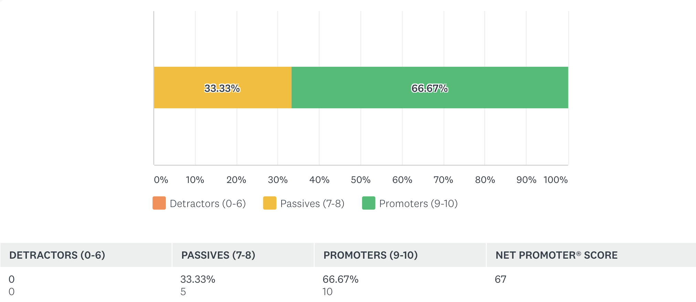

---
title:              Kay: Adding Soundscapes to Imagery
author:             Deirdre Hegarty, 15187799
email:              deirdre.hegarty@mu.ie
date:               March, 2019
supervisor: 		Dr. Charles Markham
department: 		Department of Computer Science

toc:                yes
fontsize:           11pt
geometry:           margin=25mm
linespacing:        1.15
papersize:          A4
link-citations:     true
...


\pagebreak


# Introduction

## Abstract

The intention of Kay is to explore the encoding of meaning into audio, and how that in turn represents its visual counterpart. Using a machine learning framework and audio references, photographs will be dissected into their object content labels. These labels will describe what is present in each image. Once images have been analysed, an audio sample that best describes each object label are retrieved from an audio reference list. The sound descriptions are then recreated in a binaural sound simulation of the input image. Multiple detected objects add to the richness and immersion of the scene. The result is to create an auditory explanation of the scene through sounds instead of words; to experience a description of an image void of language.

## Motivation

Much research has been invested in the dissection of images into text and speech; both channels embedded in human interpretation and understanding. Text-based descriptions are heavily restricted by language. Meaning can become lost between the translation of one language description to another. Each layer of abstraction introduces an opportunity for miscommunication or ill interpretation of the visual. Budd speaks about the lexical ambiguity of language-based descriptions, explaining how "a “mole” may be a burrowing animal or an information gatherer in an organization"[@budd]. This ambiguity not only means that a description may be interpreted in different ways in a given language, but also means that once translated into another language, the chosen interpretation may have been inaccurate. This new inaccurate description may then be subjected to its own language specific misinterpretations. Thus, creating a tree of correct and incorrect possible descriptions of an event.

"A picture is worth a thousand words", an English idiom, encapsulates the idea that there are limits associated with language-based descriptions of a scene. Ultimately, there can only ever be a finite amount of words that will accurately describe the seen. This idiom is said to be derived from an advertisement in Syracuse Post Standard newspaper - "Use a picture. It's worth a thousand words."[@englishidiom].

Listening to speech describing a narrative can reveal to the listener, factual data about the scene. Because the predominant exploration of image has been in relation to its conversion into a language-based media, user experience and immersion have been set to the background. 

The visual and auditory systems overlap; each sensory system providing the missing piece for the other[@seeingsounds]. Synaesthesia describes the impression of one sense on another, whereas cognition can reflect a learned association of the same. Audio has a huge affect on the experience of an event because the "auditory system gives more precise temporal information and appears to dominate perception of when events occur"[@seeingsounds2]. It is over time that we learn how duration and auditory cognition encodes importance of event.

An auditory response that is produced naturally by an object can be a pure description of event. It evokes a more primitive response that can reduce the misinterpretation of its visual counterpart. It is free of language and is an uninhibited description of a real-time interaction. Auditory response is less likely to become tarnished by misinterpretation, because it is not dependent on language or speech. What is meant by this is, more can be attributed to hearing the sound an object produces as opposed to being presented with a sentence that describes the same. Kay seeks to evoke a hearing of "another story behind the main narrative, the hidden story arising from the seat of the unconscious"[@soundandsilence]. A sense of otherness is created through the use of audio samples as opposed to a formal description of the scene through sentences, synthesised by a vocoder. 

## Problem Statement

According to the 2016 Census, the percentage of people with visual impairment increased by 6% between 2011 - 2016. This means that in 2016, 54,810 people living in Ireland were acknowledged as being visually impaired[@censusprofile9]. The work of Jiang, Lin and Qu addresses real-time image to speech processing. Their work outlines the implementation of a system where "both visual object and audio sound can be spatially localized"[@letblindsee]. Although their project implements spatial sound techniques for placement of audio in space, the use of description through language removes the participant from the immediate experience of the scene.

The NCSE Press Release outlines that 1 in every 65 children in Ireland are diagnosed as being on the Autistic spectrum[@ncsepress]; this equates to 1.5% of students attending school in 2016. This demographic could be considered to be an audience that would benefit greatly from a tool that provides interactive visual and aural support for learning about objects in context. Creating an alternative to textbook based learning allows for a more bespoke learning experience. In their paper, Tanner, Dixon and Verenikina state that "visual learning dimension incorporated in digital technologies is supportive of the visual modality of students with ASD"[@autismdigi].


\pagebreak


# Topic Material

Although there exists multiple tools for the conversion if image into another format, none implement image to sound in the same way as is intended by Kay.  

VizWiz[@vizwiz] and TapTapSee[@taptap] are examples of two mobile applications designed to assist the visually impaired. VizWiz implements "quikTurkit", a project specific feature built using the TurKit API[@turkit] for recruiting human workers to executing tasks on Mechanical Turk[@mechanicalturk]. The application makes use of image, voice recording and speech to text, to facilitate users in receiving information about a specific object or scene. Its academic paper highlights issues regarding speech to text conversion, stating that it has a 15.8% success rate in accurately converting voice recorded questions into text for later answering. Although image classification and analysis relies on this conversion, the human classifier can listen to the voice recorded question captured by the user. Therein lies a possible issue or restriction caused by language based analysis. 

Both VizWiz and TapTapSee use VoiceOver[@voiceover], a gesture-based screen reader on iOS. However, TapTapSee does all image processing programmatically as opposed to outsourcing to Mechanical Turk's human workers. Because of the nature of the application, it cannot answer the same multitude of questions as VizWiz. Its focus is on the classification of objects, as opposed to VizWiz's capability of answering virtually any question about an image. It has a predefined number of detectable object classes which it uses to classify objects in a given image. The answer is spoken to the user and displayed on the device screen in text format. Although the application allows for multiple languages, it does not supply the user with information such as location. Thus removing the user from the immediate experience of object interaction.

Gupta and Mannem's work explores the synthesis of anthropomorphic descriptions through the use of image annotations in the form of captioning. Their work puts emphasis on how "human-like descriptions can be generated" through task-based evaluation of results, and the need for "automatic conversion of image annotations to natural language"[@annotationdesc]. Because their predominant focus is on human-like descriptions of images, the importance of description has been places on factual labelling of images as opposed to the direct experience of image through non-language based channels.

Perhaps the closest relating research to the work outlined in this paper, is outlined in 'The Visual Microphone: Passive Recovery of Sound from Video'[@visualmic]. High speed footage captures vibrations on the surface of an object. This footage then allows for the sound that has been encoded in the objects surface to be recovered[@visualmic]. The object in question acts as the medium through which sound is visualised. This allows for a more pure retrieval of audio from visual. Although the user can remain present within the description of event, the object that is being analysed is acting as a proxy amplifier for sound events tied to other objects. Therefore the project does not recreate sound tied to a specific object, but the sound of surrounding objects.

Krishnan, Porkodi and Kanimozhi take a more conceptual approach to audio conversion. Their work allows for the production of audio directly from an image. Sustain and frequency are determined by the output of canny edge detection on an image; low frequencies are captured in horizontal edges, and higher frequencies in the vertical edges[@cannyaudio]. Their work presents and investigates an alternative view on image dissection and audio production. However, the audio that is produced is of a more abstract nature than most other image classification and object detection systems. The audio produced describes the visual in a more conceptual way, as opposed to using a conventional language based location output, or simply retrieving the audio that is natively emitted by the object.


\pagebreak


# The Solution

## Website

The decision for creating a web-based application stemmed from the intention of providing a readily accessible tool to a large audience. It was thought that there would be a restriction of audience if the application were to be a native application for mobile devices or desktop machines. The main advantage to making the application web-based, is the fact that it can reach a large audience on a wide variety of devices and operating systems. However, currently Apple iOS and Safari is not supported. The Bootstrap framework provides a responsive and adaptive layout for use on a multiple of device types [@bootstrap]. Bootstrap offers many predefined components, and HTML and CSS-based templates to facilitate many different viewport sizes. 

The main languages used to develop this web application are JavaScript and Python, with Flask providing much of the routing and data handling functionalities. Flask is a lightweight framework, written in Python, that allows for the development of web applications [@flask].   

The User Interface (UI) uses Flask-Dropzone[@flask_dz] and Flask-Uploads[@flask_up] for file uploading functionality. Selected files are validated against a list of predefined accepted file types. The dropzone will reject a file if it is not of an accepted format. Client-side sessions are used for differentiating and managing both original and image detected files. 

Once a user has successfully uploaded a file, Flask passes the file to Tensorflow for object detection. After detection has occurred, Flask receives the processed image along with meta-data including detected objects' locations in the input image, name and a reference to the detected objects' associated sounds. Flask then renders the retrieved data into HTML. The associated sounds are rendered inside the source of HTML audio tags, and are later triggered using WebAudio API, an API for audio manipulation written in JavaScript[@web_audio]. Figure 1 explains how each of the systems components interact with each other.


## Object Detection

Object detection is handled by TensorFlow. TensorFlow is an open-source library for numerical computation, and is well known for its use in the field of machine learning and deep learning[@tensorflow]. The dataset used by the Convolutional Neural Network (CNN) model is Microsoft COCO[@coco]. The Microsoft COCO dataset contains 91 "thing" object categories. Compared to PASCAL VOC 2012[@pascal], SUN[@sun] and ImageNet[@imagenet], Microsoft COCO has more instances per category, and focusses on the detection of objects in their natural contexts. 


The output image generated by Tensorflow contains bounding boxes with labels that display the detected class and percentage of AP (average precision) of each detected object (as shown by Figure 2). Extra functionality is added to the Tensorflow source code to facilitate the retrieval of bounding box coordinates, and detected object names as strings.


The retrieved coordinates contain the min and max X and Y values for each bounding box rendered in the output image. It is important that the coordinates that are retrieved correlate with their associated object, as they are used for the placement of each objects audio on an aural plane. The list of strings that contain each objects names are equally as important as they are rendered in the browser as a list, and used for associated sound identification and retrieval. 

Originally Keras, a high-level neural networks API[@keras] which can run on top of Tensorflow, was considered to be good tool for developing Kay. Using Keras would have proven problematic later in the project when retrieving audio for corresponding object classes. Keras provides the use of simple APIs, in turn limiting the control over data manipulation. Because of the decision to use Tensorflow directly, it was possible to add to and alter the code for the CNN model, creating extra functionality that was not already present.


## Label Retrieval

After the input image has been processed by Tensorflow label retrieval takes place. A series of method calls retrieve the location for each detected objects and their associated sounds from a JSON array. A dictionary mapping sounds to location is then returned to Flask.

Each JSON object contains the name, id, display name and path to associated sound file. The name and id keys contain the same values that are used by the Tensorflow CNN, while the display name key references the name of the detected object as it is to be displayed. Below is an example of one such JSON object.

```javascript
{
  "name": "/m/0199g",
  "id": "2",
  "display_name": "bicycle",
  "sound":"sounds/zapsplat_vehicles_bicycle_bell_ring_001_20821.mp3"
}
```

To calculate the binaural audio position, the center point of the object is found. Next a transformation is applied to transform the objects centre point, which is relative to the image(0...1), to the range of the audio panner (-1...1). The following equation reflects the afore mentioned transformation.

\begin{align}
& \left( \frac{X_{min} + X_{max}}{2} \right)                             & \text{Find the centre point of the object}                  & \nonumber \\
& \left( \left(\frac{X_{min} + X_{max}}{2}\right) - 0.5 \right)          & \text{Shift the range from (0 \dots 1) to (-0.5 \dots 0.5)} & \nonumber \\
& \left( \left(\frac{X_{min} + X_{max}}{2}\right) - 0.5 \right) \times 2 & \text{Multiply by two to give a range of (-1 \dots 1)}      & \nonumber \\ \nonumber
\end{align}


## Sound Retrieval and Triggering

Before research had taken place, it was assumed that Python would provide a perfect solution for triggering multiple audio files via different channels. An initial solution for dynamically retrieving audio relating to specific object classes was developed using Pygame[@pygame]. However, there came an issue when integrating the Pygame module into the Flask application. Pygame and Flask compete to work on the main thread; throwing errors. Instead of trying to process the audio functionality in the backend, a client-side solution using Web Audio API[@web_audio] was implemented. Written in JavaScript, Web Audio API allows for the same functionality as Pygame, without restricting audio samples to a specific number of channels.

JavaScript is used to map each HTML audio tag to a function that extracts the pan value from the tag's class attribute. The pan value and audio file is loaded into a buffer. Each audio file in the buffer is triggered at 2 second intervals. Web Audio API offers PannerNodes [@web_audio_pan], which allow for each audio file to be panned relative to their position in the detected input image. BufferLoader[@web_audio_buf] used alongside the PannerNodes simulate the placement of audio on a virtual 3-dimensional audio plane. A more detailed explanation of this functionality can be found in Appendix B under the heading 'Sound Retrieval'.

Kay 1.0 does not make use of an API for retrieving audio. FreeSound offers an API for the retrieval of specific and related sounds[@freesound]. The idea of incorporating an API would make for dynamic sound retrieval for attaching multiple sound profiles to a specific object; however, the poor quality of a large percentage of sounds available via FreeSound API did not validate a decision to include it at this present time. An alternate decision was made to store audio files in a local directory. The files are sourced from two royalty free sound effect libraries, Zapsplat[@zapsplat] and AudioHero[@audiohero]. 

The decision of placing a 2 second gap between the triggering of each audio sample was an instinctual and intuitive one. After researching the motive behind this subconscious decision it was uncovered that there appears to be an agreed upon standard from the 1980s regarding the 2 second default gap between audio tracks on a CD. Although multiple forums contain arguments as to whether the standard was really a standard at all, it is said that "In 1980 Philips and Sony produced their Red Book, which laid down all the standards for compact discs"[@bbc]. In its online manual "Splitting a recording into separate tracks", Audacity reference the 2 second gap advising to "add the standard 2-second gap between each track" while exporting multiple tracks to a CD[@audacity]. 

There was a conscious decision made to retrieve only true sounds emitted by an object, and not relative sounds to where an object resides. Because of this decision, there are many detected objects that do not have an associated sound; the objects in question are silent and do not produce any sounds themselves. With this decision comes an issue regarding context. A plate that is flat on a table makes no noise, however there is an anticipation of sound if presented with an image of a plate falling towards the ground. This is a bigger question that cannot immediately be addressed as it is currently out of the scope of this project.

## Documentation and Version Control

Throughout the development of Kay, Git[@git] has been used to track code progression and documentation. Git, along with Github[@github] allows for local and remote versions of the project to exist. While working on a specific feature Git is used to locally store and document code changes. Once a more realised version of the feature is completed, the changes are then pushed to the remote repository on Github. The repository that contains Kays source code is public and facilitates subscribers to track any changes to the code base, refinement of features, bug fixes and extra documentation; it marks all progress made throughout the year, and is a mapping of process and anaylsis in real-time.

The chosen documentation format for Kay is Markdown, a plain text markup language that can be converted into a multiple of different formats. Github supports Markdown and so no conversion is necessary to view documents via a browser. The simplicity of Markdown has made it easy to write and commit documents to Github for version control; it also allows for the conversion of documents into another file format using Pandoc[@pandoc]. Written in Haskell, Pandoc is an open-source document converter that is well maintained and has a large community.

Kay was constructed on three stages. The first stage being the object detection prototype, the second was the audio retrieval, then the final stage combined the object detection and audio retrieving prototypes. After the prototypes were successfully combined into a Flask application, the final audio triggering was completed. The first stage has been documented [here](https://github.com/DeirdreHegarty/Msc_Project/blob/master/code/app/docs/image_labelling_w1_to_w5.md) and in Appendix A. The remaining stages have been documented [here](https://github.com/DeirdreHegarty/Msc_Project/blob/master/research/Project_Breakdown.md) and in Appendix B.


\pagebreak


# Verification and Evaluation

## Software Verification

Selenium facilitates the automation of web browsers for UI testing [@selenium]. Selenium itself does not offer a testing frame work. It does however offers Python bindings to access Python's unittest module[@pyselenium]. On the index page of the website UI tests validate interface attributes such as links in the navigation bar, file formats that are accepted through the dropzone, and that only one file can be uploaded at a time. Tests written for the result page verify that detected objects' names are displayed as a list, the number of audio tags matches the length of the objects' names list, that associated audio is retrieved, and finally, the tests verify that there is a panning value present in each audio tag. A large bug was found after executing these tests. The bug meant that the dropzone rejected any file if its extension was either in uppercase or .png format. 

Through coarse personal testing before Alpha Testing and User Acceptance Testing (UAT), two substantial bugs were detected. The first bug occurred when an object was present that did not have a valid associated sound file, a 404 Not Found response code was returned. This meant that no other successfully retrieved audio files were being triggered. The solution for this was to map silent objects to an mp3 file that contains 250 milliseconds of silence. 

The second bug was if an object were to be located in the center of the image, its audio was grossly misplaced to be either panned at -1 or +1 position(far left or far right in the aural plane). The bug was caused by returning too many decimal places when calculating the center of the bounding boxes that surround each of the detected objects. This bug was introduced as a by-product of trying produce accurate calculations of position. Web Audio API can only correctly handle panner values that contain up to 1 decimal place.

A group of three people were selected for a Alpha Testing of the application. The testers received a high level explanation of the project and were asked to explore Kay intuitively. This process uncovered that iOS and Safari are not currently supported by Kay 1.0.

## System Evaluation

The 15 people selected for UAT were asked to use the application and fill out an anonymous survey that reflects their experience and general thoughts. The test group varied in gender, race, cultural background and technical background. 33.34% of the test group either had a visual impairment themselves, or knew someone with a visual impairment. The questions on the survey focused on technical aspects of the interaction such as image upload times, rejected file types and devices used, as well as expectation and opinion based questions.


At the time of the survey the bug regarding file extensions in uppercase and .png files had not yet been fixed. Even with this bug present, 80% reported no issue when uploading an image. One of the participants who encountered this issue stated that they had been using an android device at the time of testing. Regarding the speed of the system, 100% reported that image processing took no more than 5 seconds before being redirected to the results page. 66.67% of these responses stated that image processing and redirection took only a few second.

93.33% of participants reported that successful object detection had occurred. When asked if the sounds played matched their expectation of what the object actually sounds like, 73.33%  of the group said yes. One participant commented that they expected a "woof" noise for a dog as opposed to a panting noise. Another participant specified that they had uploaded an image of multiple children playing and that the "the sound of human doesn't fit the sound of children".


{width=300px}





20% of participants stated that binaural audio was not placed as they had anticipated however only 53.33% of participants wore headphones, which could have been a contributing part of this feedback. A document containing the full survey question set and responses can be found in Appendix C.


\pagebreak


| Answer choices    | Responses |
|-------------------|-----------|
| Yes               | 53.33%    |
| No                | 6.67%     |
| Some, but not all | 40.00%    |


Tab.1: Did the application successfully identify the object(s) in your image?


| Answer choices | Responses |
|----------------|-----------|
| Yes            | 53.33%    |
| No             | 20.00%    |
| Other          | 26.67%    |


Tab.2: When the audio played, did it play in relation to the object that was detected (if a dog was found in the left of the image, was the dog sound played in the left headphone)?


| Answer choices | Responses |
|----------------|-----------|
| Excellent      | 73.33%    |
| Very good      | 26.67%    |
| Good           | 0.00%     |
| Fair           | 0.00%     |
| Poor           | 0.00%     |


Tab.3: Overall, how would you rate this application?

\pagebreak

# Conclusions and Beginnings

## Results Discussion & Understanding Limitations

Experience imprints an impression on all objects, and so it is naive to assume that all people will experience, see, hear and interpret a scene in the same way. Cognition and learned associations drive how we link the visual to aural experience.

Currently the mapping of audio to object is 1:1. With this comes bias and inaccuracy. A comment from one of the UAT participants regarding the expectation of hearing children playing as opposed to the more generic "human" sound, highlights a sub category of bias that is currently present in Kay. There also exists biases in relation to culture, gender and personal bias introduced by myself. Because the associated files for audio have been chosen personally, there is a personal bias introduced that is ingrained by personal experience and cognition.

The decision against using FreeSound API limits the range of audio files that can be retrieved in relation to a specific object. The use of such an API would combat, but not eradicate some bias as associated audio files could be retrieved on an alternate and random basis. 

Because the accepted input is of static images, system latency has not been an issue. 100% of the UAT participants reported that it too no longer than 10 seconds between the upload time, processing and redirection to the results page. If the input were to be moving image then this 10 seconds would most likely grow exponentially in size. At this time the power of one server is enough to encapsulate all things related to Kay, however as this may not remain the case in the future.

There are more questions to be asked and answered, such as "what is the value of detecting multiple object in a specific category", and "should there be some sort of cap of threshold". There is value in distinguishing aurally the difference between 1 and 5 dogs; but perhaps the difference between triggering the audio for 20 dogs versus 50 dogs does not add any more value to the user experience or aural context of a scene. However, the response to Kay in its current state has been very positive. This is illustrated by the responses captures by the survey in Table 3 and in Figure 6.

## Future Work

There are some aspects of Kay that could benefit from further development. The first being the object associated audio files. Perhaps FreeSound API is not the right solution at this current time, but maybe in the future the quality of the library will change. Either way, some sort of audio related API would be a good addition to Kay. Alternatively, the collection of multiple audio files to a related object instance could be obtained and stored locally as before. A new functionality that randomly and alternately retrieves different associated audio responses to detected objects could be implemented.

Exploration of moving image is the a long-term goal of Kay. With this goal comes a mass of new hurdles and growing pains. Context of objects and the generation of key frames and semantic image analysis would be an important route of study before the implementation of any such features.

Along with the expansion of audio, an expanded detected class list for images would benefit Kay greatly. The main priority of the Kay 1.0 was to provide a minimum viable product that articulates clearly a proof of concept. The current model can be trained on new classes for object detection in the future. Alternatively a new pretrained model could be substituted in for the current CNN, or a custom model could be created.

\pagebreak

## References

<div id="refs"></div>


\pagebreak


# Appendix A

## Image Labelleing Prototype [Weeks 1 - 5]

### TO RUN: 

```python
FLASK_APP=main.py FLASK_DEBUG=1 flask run
```

### File Structure

```
app
|-- detected_images
|   |-- dog.jpg
|   `-- dog_car.jpeg
|
|-- main.py
|
|-- object_detection
|   |-- __init__.py
|   |
|   |-- data
|   |   |-- __init__.py
|   |   `-- mscoco_label_map.pbtxt
|   |
|   |-- object_detection_main.py
|   |
|   |-- ssd_mobilenet_v1_coco_2017_11_17.tar.gz
|   |
|   |-- test_images
|   |   |-- image1.jpg
|   |   |-- image2.jpg
|   |   `-- image_info.txt
|   `-- utils
|       |-- __init__.py
|       |-- label_map_util.py
|       |-- label_map_util_test.py
|       |-- visualization_utils.py
|       `-- visualization_utils_test.py
|
|-- ssd_mobilenet_v1_coco_2017_11_17
|   `-- frozen_inference_graph.pb
|
|-- templates
|   |-- results.html
|   |-- skeleton.html
|   `-- upload.html
|
`-- uploads
    |-- dog.jpg
    `-- dog_car.jpeg

```

*Image Labelling Prototype* is a Flask application with a TensorFlow backend. The prototype offers the following functionality:

* To upload images:
  * drag and drop image functionality
  * file explorer to choose upload image
  * **accepted image extensions = '.jpg', '.jpeg', 'png'**
* Output object detected image with bounding boxes & labels
* Output a list of detected classes (defined by COCO dataset)   

When an image is uploaded to the application, Flask passes the image to the `/uploads`. Tensorflow can then retrieve the images from `/uploads` and perform object detection.   

An output image is generated and written to `/detected_images`; this image will have bounding boxes drawn around the detected objects, along with labels containing the detected class and percentage of AP (average precision). The list of classes present in each image is passed from the Tensorflow module to Flask, to be created in the DOM and displayed in the browser.  

### object_detection_main.py (TensorFlow)
* check if model is downloaded, and download if not present
* load frozen TensorFlow 
* load the label map [imported from `label_map_util.py`]
* delete previously uploaded images
* loop through images in `/uploads`
* load image into numpy array & reshape for tf model 
* feed images to tf model 
* detect objects & calculate AP
* visualise the result [imported from `visualization_utils.py`]

*There is functionality present for live camera feed, however, I do not currently have a GPU (works with CPU but very slow and jumpy).*

### main.py (Flask)
* `@app.route('/results')`
  * uses `flask_dropzone` and `flask_uploads` to allow for drag and drop functionality for image uploads
  * set allowed upload types
  * sends accepted images to `/uploads`
  * checks contents of `/uploads` and redirects to `/results`
* `@app.route('/results')`
  * triggers tf model to load
  * triggers tf object detection on uploaded images
  * accepts list of detected classes & displays list along with uploaded image
  

# Appendix B

## Flask-Dropzone and Flask-Uploads

\footnotesize

```
# basic Flask-Dropzone & Flask-Uploads file structure

app
|-- detected_images
|   |-- dog.jpg
|   `-- dog_car.jpeg
|
|-- main.py
|
|-- templates
|   |-- results.html
|   |-- skeleton.html
|   `-- upload.html
|
`-- uploads
    |-- dog.jpg
    `-- dog_car.jpeg

```

\normalsize

Flask-Dropzone allows for files to be dragged and dropped into a Flask application with Drozone.js [@flask_dz]. A dropzone object is created and configured to accept images as input.  

Flask-Uploads is included to handle uploading of files to specific destinations. [@flask_up] 

### upload functionality

*uploads.html*  
`dropzone.create()` handles the uploads from a dropzone. It's argument needs to be set to the route that contains the dropzone.
[@flask_dz_create] 

\footnotesize

```python
# ...

	<h1>UPLOAD</h1>
	{{ dropzone.create(action_view='upload') }}
 
```

\normalsize

*skeleton.html*  
The dropzone object is loaded and style is applied. [@flask_dz_resource]

\footnotesize

```python
# ...
<!-- dropzone -->
{{ dropzone.load() }}
{{ dropzone.style('border: 2px dashed #0087F7; margin: 10%; min-height: 400px;') }}
# ...
```

\normalsize

*main.py*   
The configurations for the dropzone object and upload behaviour are set using Flask-Uploads and Flask-Dropzones predefined property settings. 

\footnotesize

```python
# ...
dropzone = Dropzone(app)
# Dropzone settings
app.config['DROPZONE_UPLOAD_MULTIPLE'] = True
app.config['DROPZONE_ALLOWED_FILE_CUSTOM'] = True
app.config['DROPZONE_ALLOWED_FILE_TYPE'] = 'image/*'
app.config['DROPZONE_INVALID_FILE_TYPE']
app.config['DROPZONE_REDIRECT_VIEW'] = 'results' 	# redirect to results.html
app.config['DROPZONE_MAX_FILE_SIZE'] = 10
app.config['SECRET_KEY'] = 'secretkey' 	 # will throw an error if not included

# Uploads settings
app.config['UPLOADED_PHOTOS_DEST'] = os.getcwd() + '/uploads'
photos = UploadSet('photos', IMAGES) # name of upload set, allowed extensions
configure_uploads(app, photos) 	 # load the configuration for the upload sets
```

\normalsize

The Flask `upload` route specifies the viewport and behaviours of the application for uploading an image. A session is started for each visit to the `upload` route. Any files from a previous sessions are cleared and the folder containing previously uploaded images is emptied.  

When a new image is uploaded, and satisfies the above configurations, the file is saved to a predetermined destination and the url is saved to the session. The application is then redirected to the `result` route.

\footnotesize

```python
@app.route("/", methods=['GET', 'POST'])
def upload():
	# empty contents of uploads folder
	object_detection_main.delete_uploads()

	# set session for image results
	if "file_urls" not in session:
		session['file_urls'] = []
	
	# uploaded image urls
	file_urls = session['file_urls']

	# clear any unsubmitted images from previous attempts
	session.pop('file_urls', None)

	# image upload from Dropzone
	if request.method == 'POST':
		file_obj = request.files
			
		for f in file_obj:

			file = request.files.get(f)
			app.logger.debug(file.filename)
			
			# save the file & append image urls
			filename = photos.save(file, name=file.filename)
			file_urls.append(photos.url(filename))

		session['file_urls'] = file_urls	
		
	return render_template('upload.html', title='upload')

# ...

```

\normalsize

### display functionality

The session is checked to see if there are any image urls. If there is nothing in the current session, the application is redirected to the `upload` route. If there is something in the current session, the images are displayed, processed and the results are saved to a predefined destination. Once this has happened the application clears the current session.  


*main.py*  
[@flask_dz_save]

\footnotesize

```python
# ...
@app.route('/results')
def results():
	# redirect to home if no images to display
	if "file_urls" not in session or session['file_urls'] == []:
		return redirect(url_for('upload'))

		# ...

	# set the file_urls and remove the session variable
	file_urls = session['file_urls']
	session.pop('file_urls', None)
 	return render_template('results.html',file_urls=file_urls)

```

\normalsize

[@dz_up]

\pagebreak

## Object Detection - Tensorflow

\footnotesize

```
# basic file structure for object detection

app
|-- detected_images
|   |-- dog.jpg
|   `-- dog_car.jpeg
|
|-- main.py
|
|-- object_detection
|   |-- __init__.py
|   |
|   |-- data
|   |   |-- __init__.py
|   |   `-- mscoco_label_map.pbtxt
|   |
|   |-- object_detection_main.py
|   |
|   |-- ssd_mobilenet_v1_coco_2017_11_17.tar.gz
|   |
|   |-- test_images
|   |   |-- image1.jpg
|   |   |-- image2.jpg
|   |   `-- image_info.txt
|   `-- utils
|       |-- __init__.py
|       |-- label_map_util.py
|       |-- label_map_util_test.py
|       |-- visualization_utils.py
|       `-- visualization_utils_test.py
|
|-- ssd_mobilenet_v1_coco_2017_11_17
|   `-- frozen_inference_graph.pb
|
|-- templates
|   |-- results.html
|   |-- skeleton.html
|   `-- upload.html
|
`-- uploads
    |-- dog.jpg
    `-- dog_car.jpeg

```

\normalsize

When an image is uploaded to the application, Flask passes the image to the `upload` route. Tensorflow can then retrieve the images from `/uploads` and perform object detection.   


An output image is generated and written to `/detected_images`; this image will have bounding boxes drawn around the detected objects, along with labels containing the detected class and percentage of AP (average precision). The list of classes present in each image is passed from the Tensorflow module to Flask, to be created in the DOM and displayed in the browser.   


*main.py*  
Before image analysis, all global variables are reset. `load_frozen_model()` is then called. This function loads a frozen Tensorflow model into memory, ready for use. Once the model is loaded into memory, image analysis can take place.  

A list of detected objects is returned from the CNN model, along with their corresponding position of detection in the image.
[@tf]

\footnotesize

```python
@app.route('/results')
def results():
	# ...

	# object detection
	vis_util.reset_class_strs()
	vis_util.reset_list_of_dicts()
	object_detection_main.load_frozen_model()
	object_detection_main.detect_image()
	# text describing class ('dog : 90%')
	classes_strs = vis_util.get_class_strs() 
	# retrieve coordinates - ymin, xmin, ymax, xmax
	list_of_dicts = vis_util.get_list_of_dicts() 

	# ...

	return render_template('results.html',
							file_urls=file_urls, 
							classes_strs=classes_strs, 
							sounds_to_trigger=sounds_to_trigger)
```

\normalsize

*utils/visualization_utils.py*

\footnotesize

```python
# ...

classes_strs = []
classes_positions = []
list_of_dicts = []

#...

def get_class_strs():
  return classes_strs

def get_list_of_dicts():
  return list_of_dicts

def reset_class_strs():
  # Slice in the list [](0 elements) 
  # at the location [:](all indexes from start to finish)
  classes_strs[:] = [] 

def reset_list_of_dicts():
  list_of_dicts[:] = []

def visualize_boxes_and_labels_on_image_array(

  # ...

  # list of classes present in image
  global classes_strs
  classes_strs.append(box_to_display_str_map[box])

  # ...

  global list_of_dicts
  list_of_dicts.append({'class' : box_to_display_str_map[box], 'coords' : box })
  return image

```

\normalsize

*object_detection_main.py*  
`object_detection_main.py` provides the main instruction set for the Tensorflow backend. It defines function for tasks including checking if the model is previously downloaded, loading the model into memory, feeding images to the model, reshaping uploaded images for tensorflow, and visualising the results.

\footnotesize

**

```python
# ...

# List of the strings that is used to add correct label for each box.
PATH_TO_LABELS = os.path.join('data', 'mscoco_label_map.pbtxt')

# ...

def detect_image():
	# ...

	ACCEPTED_FILE_TYPES = ['.jpg', '.JPG', '.jpeg', '.JPEG', '.png', '.PNG']

	# ...

		image_np = load_image_into_numpy_array(image)

		# Actual detection.
		output_dict = run_inference_for_single_image(image_np, detection_graph)

		# Visualization of the results of a detection.
		vis_util.visualize_boxes_and_labels_on_image_array( ... )

		plt.figure(figsize=IMAGE_SIZE)
		plt.imsave(os.path.join(DETECTED_IMAGES,image_path), image_np)
		plt.close() # causes issue if missing

```

\normalsize

*mscoco_label_map.pbtxt*  
This contains the mapping of object classes to name, and is referenced by the CNN model.

\footnotesize

```python
# ...

item {
  name: "/m/04_sv"
  id: 4
  display_name: "motorcycle"
}
item {
  name: "/m/05czz6l"
  id: 5
  display_name: "airplane"
}
item {
  name: "/m/01bjv"
  id: 6
  display_name: "bus"
}
item {
  name: "/m/07jdr"
  id: 7
  display_name: "train"
}

# ...
```
\pagebreak


## Sound Retrieval

\footnotesize

```
# basic file structure for sound retrieval

app
|
|-- detected_images
|
|-- main.py
|
|-- sound_retrieval
|   |-- sound_list.json
|   `-- trigger_sound.py
|
|-- static
|   |-- js
|   |   |-- audio_panning.js
|   |   `-- buffer-loader.js
|   |
|   `-- sounds
|
|-- templates
|   |-- results.html
|   `-- skeleton.html
|
`-- uploads


```

\normalsize

*main.py*  
Once the detected object bounding boxes have been returned by the CNN, the coordinated are parsed and the center point of each object is calculated. A new list containing the audio class name to be triggered (e.g. 'dog') and center coordinate, is created. The list is passed to `trigger_sound.py` and is later rendered in `results.html`.

\footnotesize

```python
@app.route('/results')
def results():

	# ...

	# extract object name from returned strings
	# and append to list
	# i.e. retrieving 'dog' from 'dog : 90%'
	obj_names = []
	temp = []
	for elm in list_of_dicts:
		xs = elm['coords'][1::2]
		x_center_obj = ((((xs[0] + xs[1]) / 2) - 0.5) * 2)
		obj_names.append({'sound': str(elm['class']).partition("'")[2].partition(":")[0],
						'x_center' : x_center_obj})
	sounds_to_trigger = trigger_sound.retrieve_list_of_sounds(obj_names)

	# ...

```

\normalsize

*trigger_sound.py*   
Once a list of detected objects has been received, `search_sounds()` parses `sound_list.json` and verifies if any associated audio file exists. A new list containing audio object information is returned to the `result` route in the Flask application.

\footnotesize

```python
# ...

def retrieve_list_of_sounds(search_string_list):
	obj_list = []
	for x in search_string_list:
		return_string_id, sound_to_trigger = search_sounds(x['sound'])
		obj_list.append({'sound': sound_to_trigger, 'x_center': x['x_center']})

	return obj_list

def search_sounds(search_string):
	return_string_id = ''
	sound_to_trigger = ''

	with open(os.path.join(SOUND_DIR,'sound_list.json')) as f:
	    data = json.loads(f.read())

	for i in data:
		if search_string in i['display_name']:
			print(i['display_name'],'found')
			return_string_id = i['id']
			sound_to_trigger = i['sound']
			print(i['sound'])
			break
		else:
			return_string_id = 'NO MATCH FOUND'

	return return_string_id, sound_to_trigger

# ...

```

\normalsize

*sound_list.json*  
`sound_list.json` contains json objects describing the relationship between image detected objects and their associated sound. 

\footnotesize

```javascript
...

{
  "name": "/m/04_sv",
  "id": "4",
  "display_name": "motorcycle",
  "sound": "sounds/Aggressive_Motorcycle.mp3"
},
{
  "name": "/m/05czz6l",
  "id": "5",
  "display_name": "airplane",
  "sound": "sounds/Prop_Plane_Fly.mp3"
},
{
  "name": "/m/01bjv",
  "id": "6",
  "display_name": "bus",
  "sound": "sounds/Bus_Horn.mp3"
},
{
  "name": "/m/07jdr",
  "id": "7",
  "display_name": "train",
  "sound": "sounds/Wooden_Train_Whistle.mp3"
},

... 

```

\normalsize

*results.html*  
Each of the retrieved audio files are rendered inside invisible html audio tags. One or more audio files can be played at a time using a javascript API, Web Audio API [@web_audio].

\footnotesize

```html




	<!-- ... -->
	
	<audio class='audio'>
	  <source class="{{ aud['x_center'] }}" src="/static/{{ aud['sound'] }}" type="audio/mpeg">
	  Your browser does not support the audio element.
	</audio>
	
	<!-- ... -->
<script type="text/javascript">
trigger_audio();
</script>


```

\normalsize

*audio_panning.js*  
In order to play and pan multiple sounds (together or staggered), each audio file is mapped to a function. This function loads each file into a buffer. Audio object attributes such as source and position/pan value are then read from the buffer and triggered in the `AudioContext`. [@web_audio_pan],[@web_audio_3d] 

\footnotesize

```javascript
function trigger_audio() {
	// for legacy browsers
	const AudioContext = window.AudioContext || window.webkitAudioContext;
	const audioCtx = new AudioContext();

	var pan_vals = [];
	var panner = null;

	bufferLoader = new BufferLoader(
		audioCtx,
		$.map($('audio source'), function(x) { 

			// extract the class from x [value to pan audio]
			var read_in = x.outerHTML;
			var str1 = read_in.substring(read_in.indexOf('class')+7);
			this.pan_value = str1.substring(0, str1.indexOf('"'));
			pan_vals.push(this.pan_value); 		//append position to a list

			//return the src [audio to be triggered]
			return x.src; }),

		function(bufferList) {
			for(i=0; i<bufferList.length; i++){

				panner = audioCtx.createPanner();
				panner.panningModel = 'HRTF';
				panner.distanceModel = 'inverse';
				panner.refDistance = 1;
				panner.maxDistance = 10000;
				panner.rolloffFactor = 1;
				panner.coneInnerAngle = 360;
				panner.coneOuterAngle = 0;
				panner.coneOuterGain = 0;

				var sound_effect = audioCtx.createBufferSource();
				sound_effect.buffer = bufferList[i];
				panner.positionX.value = pan_vals[i];
				sound_effect.connect(panner).connect(audioCtx.destination);
				sound_effect.start(i*2); // 2 second delay between sounds
			}
		}
	);
	
    bufferLoader.load();
}
```

\normalsize

*buffer-loader.js*  
`buffer-loader.js` specifies how an `AudioNode` is loaded in the buffer. It uses AJAX to retrieve files. If the audio file is valid, the file is added to the buffer and returned. 
[@web_audio_buf]

\footnotesize

```javascript
function BufferLoader(context, urlList, callback) {
	this.context = context;
    this.urlList = urlList;
    this.onload = callback;
    this.bufferList = new Array();
    this.loadCount = 0;
}

BufferLoader.prototype.loadBuffer = function(url, index) {
    var request = new XMLHttpRequest();
    request.open("GET", url, true);
    request.responseType = "arraybuffer";

    var loader = this;

    request.onload = function() {
        loader.context.decodeAudioData(
            request.response,
            function(buffer) {
                if (!buffer) {
                    alert('error decoding file data: ' + url);
                    return;
                }
                loader.bufferList[index] = buffer;
                if (++loader.loadCount == loader.urlList.length)
                    loader.onload(loader.bufferList);
            }    
        );
    }

    request.onerror = function() {
        alert('BufferLoader: XHR error');        
    }

    request.send();
}

BufferLoader.prototype.load = function() {
    for (var i = 0; i < this.urlList.length; ++i)
        this.loadBuffer(this.urlList[i], i);
}
```

\pagebreak


# Appendix C


